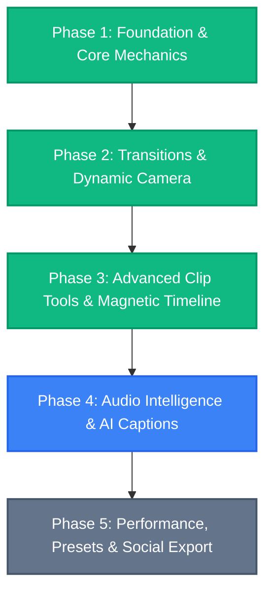

# 🗺️ Captr Studio — Product & Engineering Roadmap

Dokumen ini memetakan visi, arsitektur, dan tahapan pengembangan **Captr Studio** untuk mewujudkan perpaduan sempurna antara **perekaman dinamis profesional** (seperti *RapidDemo* dan *Screen Studio*) serta **kemudahan editing video langsung** (seperti *CapCut*, *Filmora*, dan *Descript*).

---

## 🎯 Visi & Tujuan Produk

1. **Dynamic Screen Experience (RapidDemo & Screen Studio)**
   - Kursor berbobot natural dengan lintasan melengkung organik (*Catmull-Rom Spline & Spring Physics*).
   - Umpan balik visual interaktif setiap klik (*Radial Wave Ripple & Glow*).
   - Auto-zoom kamera cerdas yang secara otomatis membidik tombol, formulir, atau jendela aktif.
   - Efek 3D Perspective Tilt yang memberikan kedalaman visual pada rekaman desktop biasa.

2. **Frictionless Direct Video Editing (CapCut & Filmora)**
   - Pemotongan klip instan tanpa hambatan fokus (*Universal Split Clip `Ctrl+B` / `C`*).
   - Penghapusan segmen otomatis merapatkan timeline (*Ripple Delete `Shift+Delete`*).
   - Transisi visual mulus antar potongan klip (*Cross Dissolve, Fade, Slide, Wipe*).
   - Pengaturan kecepatan klip (*Speed Ramping & Multiplier*).
   - Karaoke-style animated captions dengan *word-by-word highlights*.

---

## 📍 Status Milestone & Rencana Tahapan

---

### ✅ Phase 1: Core Dynamics & Essential Editing (COMPLETED)
- [x] **Zero-Latency Startup**: Mengeliminasi delay klik start recording melalui paralelisasi inisialisasi hardware capture dan instant UI feedback.
- [x] **Click Ripple Wave & Glow**:
  - Animasi lingkaran radial *cubic ease-out* di kursor saat klik mouse.
  - Paritas penuh antara PixiJS WebGL preview dan Canvas 2D video export.
- [x] **Cinematic Cursor Path**:
  - Peningkatan algoritma interpolasi dari linier ke **Centripetal Catmull-Rom Spline** melintasi titik telemetri kursor.
  - Pergerakan kursor kini mengalir mulus tanpa patahan sudut tajam.
- [x] **Universal Split Clip (`Ctrl+B` / `C`)**:
  - Pemotongan klip di playhead kapan saja secara global tanpa memerlukan fokus klik timeline.
  - Penomoran klip dinamis terurut di timeline (`Clip 1`, `Clip 2`...).
- [x] **Ripple Delete (`Shift+Delete`)**:
  - Menghapus klip yang salah/jeda hening sekaligus otomatis merapatkan seluruh klip, zoom, anotasi, dan audio di sebelah kanannya (*gap closing*).

---

### ✅ Phase 2: Video Transitions & Dynamic Camera (COMPLETED)
- [x] **Clip Transition Engine**:
  - Pembuatan slot transisi pada sambungan antar klip di timeline.
  - Pilihan efek transisi bawaan:
    - *Cross-Dissolve / Dissolve* (peleburan halus gambar A ke B).
    - *Fade to Black / Dip to White* (efek sinematik jeda antar babak).
    - *Slide Left / Slide Right* (geser konten seperti presentasi modern).
    - *Zoom In / Zoom Out Push* (transisi dorong dinamis).
  - Durasi transisi yang dapat disesuaikan (200ms - 1000ms).
  - Terintegrasi penuh pada PixiJS WebGL preview & modern frame exporter.
- [x] **Smart Auto-Zoom Framing (RapidDemo style)**:
  - Deteksi otomatis area klik atau ketikan teks untuk menghasilkan bounding box fokus kamera.
  - Penyesuaian kedalaman zoom adaptif (*depth 1–4*) berbasis luas interaksi dan tipe aksi (dropdown, seleksi teks, form click).
  - Transisi kamera berbasis *damped spring harmonic oscillator* untuk framing fokus yang anggun tanpa hentakan.
- [x] **3D Perspective & Tilt**:
  - Efek rotasi sudut pandang 3D halus (*pitch & yaw tilt*) hingga $\pm 3.5^\circ$ mengikuti pergerakan kursor di sudut layar.
  - Kompensasi pusat video berbasis tangen skew sehingga titik tengah video tetap diam dan stabil saat layar miring.
  - Kontrol slider intensitas 0–100% pada panel pengaturan dengan persistensi preferensi editor.

---

### ✅ Phase 3: Advanced Clip Manipulation & Timeline UX (COMPLETED)
- [x] **Magnetic Timeline Snapping**:
  - Magnetik snap saat menggeser tepi klip, zoom region, atau playhead ke titik cut terdekat.
- [x] **Visual Video Trim Handles**:
  - Handle visual di awal dan akhir tiap klip pada timeline untuk *quick edge trimming* dengan glowing cyan accent dan grip timbul.
- [x] **Per-Clip Speed Ramping**:
  - Kontrol kecepatan tiap potongan klip (0.25x hingga 8x) dengan koreksi pitch audio dan otomatis ripple-shift seluruh klip & layer berikutnya.
- [x] **Color Grading & Video Filters**:
  - Filter visual sinematik: Clean Studio, Cyber Glow, Warm Editorial, Cool Minimalist, Black & White.
  - Penyesuaian manual: Exposure, Contrast, Saturation, Vignette (dengan squircle corner masking), serta persistensi project dan export parity 100%.

---

### 🎙️ Phase 4: Audio Intelligence & AI Captions (CapCut / Descript Style)
- [x] **Indonesian & Multilingual AI Captions**:
  - Dukungan Bahasa Indonesia (`id`) langsung di Whisper model pipeline dengan pilihan model ringan (Base) dan akurasi tinggi (Small).
- [x] **Silence & Dead-Air Detector ("1-Click Cut All Pauses")**:
  - Deteksi jeda hening / dead-air otomatis berbasis energi RMS sliding window dengan threshold sensitivitas dan speech-padding.
  - Dialog interaktif dengan penyesuaian durasi minimal (0.6s - 3.0s), slider ambang desibel (-50dB s.d. -20dB), serta 1-klik ripple cut yang merapatkan seluruh klip dan overlay.
- [ ] **Studio Sound & Noise Cleanup**:
  - Penghilang noise latar belakang (fan noise, hiss, room echo) bawaan secara offline.
- [x] **Smart Audio Ducking (Auto-Ducking BGM)**:
  - Meredam volume musik latar (`AudioRegion`) secara otomatis ketika vokal narator terdengar, dan menaikkannya kembali secara mulus saat jeda bicara.
  - Mekanisme *anti-pumping* cerdas dengan *speech interval merging* dan *hold time* (hysteresis).
  - Paritas 100% antara preview player (`VideoPlayback.tsx`) dan pipeline ekspor Web Audio (`audioEncoder.ts`).
  - Pengaturan fleksibel: toggle ducking per-track audio dan kontrol intensitas ducking (-6 dB s.d. -26 dB) di Settings Panel.
- [x] **Animated Karaoke Captions (TikTok / Alex Hormozi Style)**:
  - Penyorotan kata per kata (*word-by-word active highlight*) dengan transisi halus dan sinkronisasi real-time.
  - 5 pilihan preset gaya:
    - *Karaoke Pop*: Zoom/scale 1.15x pada kata aktif dengan warna neon kontras tinggi.
    - *Alex Hormozi*: Teks tebal ekstra (font weight 900), scale 1.12x, dan drop-shadow gelap pekat.
    - *Neon Glow*: Efek halo glow bercahaya cyberpunk pada kata yang sedang diucapkan.
    - *Box Pill*: Kotak pill bundar (*squircle*) berlatar warna kontras mengelilingi kata aktif.
    - *Classic*: Transisi warna teks bersih tanpa perbesaran skala.
  - Palet warna highlight cepat: Neon Yellow (`#FFE600`), Lime Green (`#22C55E`), Electric Cyan (`#06B6D4`), Hot Pink (`#EC4899`), Flame Orange (`#F97316`), serta pemilih warna kustom (*color picker*).
  - Sakelar toggle otomatis huruf kapital semua (*Uppercase / ALL CAPS*) dengan *pre-layout calculation* sehingga baris teks tidak pernah meluap (*overflow*).
  - Paritas 100% antara pemutar preview editor dan hasil ekspor video (Canvas 2D / WebGL / MP4).

---

### 📦 Phase 5: Hardware Acceleration & Social Presets
- [x] **Ultra-Fast GPU Export**:
  - Pemanfaatan hardware-accelerated video encoders: **NVIDIA NVENC** (`h264_nvenc`), **Intel QuickSync** (`h264_qsv`), **AMD AMF / VCE** (`h264_amf`), dan **Apple VideoToolbox** (`h264_videotoolbox`) untuk render ekspor video hingga 5x lebih cepat.
  - Penambahan argumen tuning mode latensi rendah dan throughput tinggi (`fast`, `balanced`, `quality`) per arsitektur GPU.
  - Encoder dinamis pada precomposited static layout (tidak lagi hardcoded ke NVENC).
  - Indikator status GPU aktif dan probing otomatis (`GpuEncoderInfo`) di menu Export Settings.
  - Unit tests komprehensif (`nativeVideoExport.gpu.test.ts`) dengan 11/11 tes lulus. TSC 0 error, Biome clean.
- [x] **Social Aspect Ratio Presets & Auto-Reframing**:
  - 6 social presets (16:9 YouTube, 9:16 TikTok/Shorts/Reels, 1:1 Instagram, 4:5 Instagram Portrait, 4:3 Classic, Native) with platform labels and ratio badges in a grouped dropdown.
  - `buildAutoReframeSuggestions()` engine with TikTok/Reels safe-zone biasing (bottom 20% captions zone, right 16% icon strip), social depth scaling (9:16 → depth ≥ 3, 1:1/4:5 → depth ≥ 2), and reservedSpans overlap guard.
  - **Auto-Reframe** button in preview header: detects cursor-activity clusters and auto-creates zoom regions optimised for the selected aspect ratio.
  - **Safe Zone** toggle: renders `SocialSafeZoneOverlay` over the preview with visual dead-zone guides for each social platform.
  - 6 unit tests all passing (`zoomSuggestionUtils.autoReframe.test.ts`). TSC clean. Biome clean.
- [x] **Export Presets & Direct Cloud Sharing**:
  - 4 1-click Quick Export Profiles (4K 60fps Ultra Cinema, 1080p Web Balanced, 720p Fast Draft, Lightweight Social GIF 30fps) dengan indikator aktif (`isMatchingQuickPreset`), high-contrast badge, dan Phosphor icons di `ExportSettingsMenu`.
  - Aksi instan paska ekspor di modal sukses: **Open Video** (langsung memutar video di media player default sistem via `window.electronAPI.openPath`), **Show In Folder**, **Copy Path** (copy ke clipboard beserta toast feedback), dan **Done**.
  - Unit tests lengkap (`exportPresetUtils.test.ts`) dengan 7/7 tes lulus. Type-safe (TSC 0 error), Biome clean.

---

## 🛠️ Prinsip Kualitas & Arsitektur Kode
1. **Never Compromise Preview / Export Parity**:
   Setiap efek visual yang terlihat di jendela preview (WebGL/Canvas) harus diekspor secara identik di file akhir (Canvas 2D / FFmpeg).
2. **Deterministic Time Mapping**:
   Setiap manipulasi timeline (split, ripple delete, speed multiplier) wajib memetakan waktu playhead ke source media secara deterministik tanpa drift audio.
3. **Safe Git Practice**:
   Semua modifikasi disimpan di *working tree* pengguna untuk ditinjau sebelum pembuatan commit permanen.
