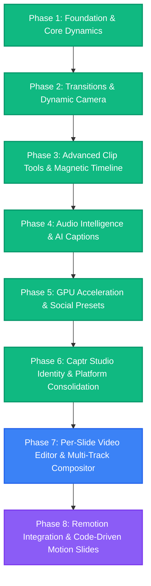

# 🗺️ Captr Studio — Product & Engineering Roadmap

Dokumen ini memetakan visi, arsitektur, dan tahapan pengembangan **Captr Studio** untuk mewujudkan perpaduan sempurna antara **perekaman dinamis profesional** (seperti *RapidDemo* dan *Screen Studio*) serta **kemudahan editing video langsung** (seperti *CapCut*, *Filmora*, dan *Descript*).

---

## Status arsitektur terverifikasi — 18 September 2026

Target produk: recording polish ala Screen Studio, storyboard/scene ala Tella, serta editing berlapis ala Filmora. Phase 7 masih **parsial**; checklist historis di bawah bukan bukti semua kemampuan tersedia.

Fondasi yang diperbaiki:
- Keyframe anotasi memakai waktu lokal layer; inspector, marker timeline, preview, dan export memakai sampler bersama. Data keyframe rusak disaring saat load.
- Transisi masuk memakai `transitionIn`; format lama dinormalisasi ke tipe renderer yang didukung. Crossfade/wipe lama belum didukung dan menjadi `none`.
- Reorder scene mempertahankan setelan audio, speed, dan transisi.
- Load dan pruning memakai daftar referensi media proyek yang sama, termasuk scene, layer, audio, dan gambar anotasi.
- Integrasi caption yang telah dihapus dibersihkan dari editor dan preload. Caption belum tersedia kembali.

Gerbang sebelum Phase 8:
- [ ] Implementasikan compositor video multi-layer nyata: source clock, trim, speed, z-order, visibility, audio, serta lifecycle decoder per layer.
- [ ] Buktikan paritas preview/export lewat proyek dua video bertumpuk, seek, split, save/load, dan hasil ekspor.
- [ ] Satukan history operasi scene dan layer; uji undo/redo lintas pergantian scene.
- [ ] Pisahkan orchestration proyek, playback, dan export dari komponen VideoEditor secara bertahap.
- [ ] Bangun ulang caption dengan kontrak data, IPC, dan pengujian preview/export yang lengkap.

Kontrak arah arsitektur: satu proyek berisi scene, setiap scene memiliki layer bertipe; Record Editor dan Video Editor menjadi dua tampilan atas model tersebut. `MediaTrackLayer` tersimpan saat ini, tetapi keberadaan tipe/persistensi belum berarti compositor videonya selesai.

---

## 🎯 Visi & Tujuan Produk

1. **Dynamic Screen Experience (RapidDemo & Screen Studio)**
   - Kursor berbobot natural dengan lintasan melengkung organik (*Catmull-Rom Spline & Spring Physics*).
   - Umpan balik visual interaktif setiap klik (*Radial Wave Ripple & Glow*).
   - Auto-zoom kamera cerdas yang secara otomatis membidik tombol, formulir, atau jendela aktif.
   - Efek 3D Perspective Tilt yang memberikan kedalaman visual pada rekaman desktop biasa.

2. **Frictionless Direct Video Editing (CapCut & Filmora)**
   - Pemotongan klip instan tanpa hambatan fokus (*Universal Split Clip `Ctrl+B` / `C`*).
   - Penghapusan segmen otomatis merapatkan timeline (*Ripple Delete `Shift+Delete`*).
   - Transisi visual mulus antar potongan klip (*Cross Dissolve, Fade, Slide, Wipe*).
   - Pengaturan kecepatan klip (*Speed Ramping & Multiplier*).
   - Karaoke-style animated captions dengan *word-by-word highlights*.

---

## 📍 Status Milestone & Rencana Tahapan



---

### ✅ Phase 1: Core Dynamics & Essential Editing (COMPLETED)
- [x] **Zero-Latency Startup**: Mengeliminasi delay klik start recording melalui paralelisasi inisialisasi hardware capture dan instant UI feedback.
- [x] **Click Ripple Wave & Glow**:
  - Animasi lingkaran radial *cubic ease-out* di kursor saat klik mouse.
  - Paritas penuh antara PixiJS WebGL preview dan Canvas 2D video export.
- [x] **Cinematic Cursor Path**:
  - Peningkatan algoritma interpolasi dari linier ke **Centripetal Catmull-Rom Spline** melintasi titik telemetri kursor.
  - Pergerakan kursor kini mengalir mulus tanpa patahan sudut tajam.
- [x] **Universal Split Clip (`Ctrl+B` / `C`)**:
  - Pemotongan klip di playhead kapan saja secara global tanpa memerlukan fokus klik timeline.
  - Penomoran klip dinamis terurut di timeline (`Clip 1`, `Clip 2`...).
- [x] **Ripple Delete (`Shift+Delete`)**:
  - Menghapus klip yang salah/jeda hening sekaligus otomatis merapatkan seluruh klip, zoom, anotasi, dan audio di sebelah kanannya (*gap closing*).

---

### ✅ Phase 2: Video Transitions & Dynamic Camera (COMPLETED)
- [x] **Clip Transition Engine**:
  - Pembuatan slot transisi pada sambungan antar klip di timeline.
  - Pilihan efek transisi bawaan:
    - *Cross-Dissolve / Dissolve*: belum didukung; membutuhkan dua source aktif bersamaan.
    - *Fade to Black / Dip to White* (efek sinematik jeda antar babak).
    - *Slide Left / Slide Right* (geser konten seperti presentasi modern).
    - *Zoom In / Zoom Out Push* (transisi dorong dinamis).
  - Durasi transisi yang dapat disesuaikan (200ms - 1000ms).
  - Terintegrasi penuh pada PixiJS WebGL preview & modern frame exporter.
- [x] **Smart Auto-Zoom Framing (RapidDemo style)**:
  - Deteksi otomatis area klik atau ketikan teks untuk menghasilkan bounding box fokus kamera.
  - Penyesuaian kedalaman zoom adaptif (*depth 1–4*) berbasis luas interaksi dan tipe aksi (dropdown, seleksi teks, form click).
  - Transisi kamera berbasis *damped spring harmonic oscillator* untuk framing fokus yang anggun tanpa hentakan.
- [x] **3D Perspective & Tilt**:
  - Efek rotasi sudut pandang 3D halus (*pitch & yaw tilt*) hingga $\pm 3.5^\circ$ mengikuti pergerakan kursor di sudut layar.
  - Kompensasi pusat video berbasis tangen skew sehingga titik tengah video tetap diam dan stabil saat layar miring.
  - Kontrol slider intensitas 0–100% pada panel pengaturan dengan persistensi preferensi editor.

---

### ✅ Phase 3: Advanced Clip Manipulation & Timeline UX (COMPLETED)
- [x] **Magnetic Timeline Snapping**:
  - Magnetik snap saat menggeser tepi klip, zoom region, atau playhead ke titik cut terdekat.
- [x] **Visual Video Trim Handles**:
  - Handle visual di awal dan akhir tiap klip pada timeline untuk *quick edge trimming* dengan glowing cyan accent dan grip timbul.
- [x] **Per-Clip Speed Ramping**:
  - Kontrol kecepatan tiap potongan klip (0.25x hingga 8x) dengan koreksi pitch audio dan otomatis ripple-shift seluruh klip & layer berikutnya.
- [x] **Color Grading & Video Filters**:
  - Filter visual sinematik: Clean Studio, Cyber Glow, Warm Editorial, Cool Minimalist, Black & White.
  - Penyesuaian manual: Exposure, Contrast, Saturation, Vignette (dengan squircle corner masking), serta persistensi project dan export parity 100%.

---

### ✅ Phase 4: Audio Intelligence & AI Captions (COMPLETED)
- [x] **Indonesian & Multilingual AI Captions**:
  - Dukungan Bahasa Indonesia (`id`) langsung di Whisper model pipeline dengan pilihan model ringan (Base) dan akurasi tinggi (Small).
- [x] **Silence & Dead-Air Detector ("1-Click Cut All Pauses")**:
  - Deteksi jeda hening / dead-air otomatis berbasis energi RMS sliding window dengan threshold sensitivitas dan speech-padding.
  - Dialog interaktif dengan penyesuaian durasi minimal (0.6s - 3.0s), slider ambang desibel (-50dB s.d. -20dB), serta 1-klik ripple cut yang merapatkan seluruh klip dan overlay.
- [x] **Smart Audio Ducking (Auto-Ducking BGM)**:
  - Meredam volume musik latar (`AudioRegion`) secara otomatis ketika vokal narator terdengar, dan menaikkannya kembali secara mulus saat jeda bicara.
  - Mekanisme *anti-pumping* cerdas dengan *speech interval merging* dan *hold time* (hysteresis).
  - Paritas 100% antara preview player (`VideoPlayback.tsx`) dan pipeline ekspor Web Audio (`audioEncoder.ts`).
  - Pengaturan fleksibel: toggle ducking per-track audio dan kontrol intensitas ducking (-6 dB s.d. -26 dB) di Settings Panel.
- [ ] **Animated Karaoke Captions (TikTok / Alex Hormozi Style)**:
  - Penyorotan kata per kata (*word-by-word active highlight*) dengan transisi halus dan sinkronisasi real-time.
  - 5 pilihan preset gaya: *Karaoke Pop*, *Alex Hormozi*, *Neon Glow*, *Box Pill*, dan *Classic*.
  - Palet warna highlight cepat: Neon Yellow (`#FFE600`), Lime Green (`#22C55E`), Electric Cyan (`#06B6D4`), Hot Pink (`#EC4899`), Flame Orange (`#F97316`), serta pemilih warna kustom (*color picker*).
  - Sakelar toggle otomatis huruf kapital semua (*Uppercase / ALL CAPS*) dengan *pre-layout calculation* sehingga baris teks tidak pernah meluap (*overflow*).
  - Paritas 100% antara pemutar preview editor dan hasil ekspor video (Canvas 2D / WebGL / MP4).

---

### ✅ Phase 5: Hardware Acceleration & Social Presets (COMPLETED)
- [x] **Ultra-Fast GPU Export**:
  - Pemanfaatan hardware-accelerated video encoders: **NVIDIA NVENC** (`h264_nvenc`), **Intel QuickSync** (`h264_qsv`), **AMD AMF / VCE** (`h264_amf`), dan **Apple VideoToolbox** (`h264_videotoolbox`) untuk render ekspor video hingga 5x lebih cepat.
  - Penambahan argumen tuning mode latensi rendah dan throughput tinggi (`fast`, `balanced`, `quality`) per arsitektur GPU.
  - Encoder dinamis pada precomposited static layout (tidak lagi hardcoded ke NVENC).
  - Indikator status GPU aktif dan probing otomatis (`GpuEncoderInfo`) di menu Export Settings.
  - Unit tests komprehensif (`nativeVideoExport.gpu.test.ts`) dengan 11/11 tes lulus. TSC 0 error, Biome clean.
- [x] **Social Aspect Ratio Presets & Auto-Reframing**:
  - 6 social presets (16:9 YouTube, 9:16 TikTok/Shorts/Reels, 1:1 Instagram, 4:5 Instagram Portrait, 4:3 Classic, Native) dengan platform labels dan ratio badges.
  - `buildAutoReframeSuggestions()` engine dengan TikTok/Reels safe-zone biasing (bottom 20% captions zone, right 16% icon strip), social depth scaling, dan overlap guard.
  - Tombol **Auto-Reframe** di preview header: mendeteksi klaster aktivitas kursor dan otomatis membuat zoom region yang dioptimalkan untuk rasio terpilih.
  - Toggle **Safe Zone**: menampilkan `SocialSafeZoneOverlay` visual panduan area aman media sosial di preview.
- [x] **Export Presets & Direct Post-Export Actions**:
  - 4 1-click Quick Export Profiles (4K 60fps Ultra Cinema, 1080p Web Balanced, 720p Fast Draft, Lightweight Social GIF 30fps).
  - Aksi instan paska ekspor di modal sukses: **Open Video** (langsung memutar di default player sistem via `window.electronAPI.openPath`), **Show In Folder**, **Copy Path** (ke clipboard), dan **Done**.

---

### ✅ Phase 6: Captr Studio Identity & Platform Consolidation (COMPLETED — v1.3.0-beta.3)
- [x] **Brand Unification**:
  - Pembersihan total sisa penamaan warisan `Recordly` dan `Rhamaa Record`.
  - Penyesuaian `AppUserModelId` Windows menjadi `studio.captr.app` dan repositori resmi ke `rhamaa/Captr-Studio`.
  - Migrasi preferensi penyimpanan tema ke `captr.theme` dengan fallback backward-compatibility.
- [x] **Official Captr Studio 'C' Aperture Logo & App Icons**:
  - Standarisasi kurva huruf **C** neon dan lensa rekaman menyala pada SVG master (`branding/source-assets/CaptrStudio.svg`).
  - Regenerasi seluruh paket ikon sistem aplikasi: Windows (`icon.ico`), macOS (`icon.icns`), Linux/Web (`icons/icons/png/*`), dan favicon.
- [x] **Native Project Format (`.captr`)**:
  - Format penyimpanan proyek mandiri baru `.captr` dengan dukungan membaca kembali berkas lama `.recordly` dan `.openscreen`.
- [x] **Native Capture Stability**:
  - Pemantapan Windows Graphics Capture (WGC) DirectX 11 + WASAPI loopback audio capture tanpa latency.

---

## 🏛️ Arsitektur Dual-Editor (Dual Main Editors)

Captr Studio memisahkan alur kerja pembuatan konten ke dalam **2 Editor Utama** yang saling terintegrasi namun dioptimalkan untuk use case spesifik:

```
                  ┌───────────────────────────────────────────────────────────┐
                  │                 CAPTR STUDIO WORKSPACE                    │
                  └─────────────────────────────┬─────────────────────────────┘
                                                │
                 ┌──────────────────────────────┴─────────────────────────────┐
                 ▼                                                           ▼
  ┌───────────────────────────────┐                           ┌───────────────────────────────┐
  │      SLIDE RECORD EDITOR      │                           │      SLIDE VIDEO EDITOR       │
  │   (Screen & Motion Capture)   │                           │ (Multi-Track NLE Compositor)  │
  ├───────────────────────────────┤                           ├───────────────────────────────┤
  │ • Fokus: Rekaman Layar & Web  │                           │ • Fokus: Multi-Media & B-Roll │
  │ • Spring Physics & Smooth Pan │                           │ • Multi-Track Layering (CapCut│
  │ • Click Ripples & Auto-Zoom   │                           │ • Voiceover / Audio Recorder  │
  │ • Dynamic Cursor Trails       │                           │ • Keyframing Pos/Scale/Rot/Op │
  │ • Webcam PiP Bubble Studio    │                           │ • Transisi Klip & Media Blends│
  └───────────────────────────────┘                           └───────────────────────────────┘
```

1. **Editor 1: Slide Record Editor (Screen Capture & Dynamic Focus)**
   - *Status saat ini: Sudah matang dan sesuai ekspektasi.*
   - Berfokus pada perekaman layar berkualitas tinggi, pergerakan kursor sinematik (*Catmull-Rom Spline*), *dynamic auto-zoom*, ripple efek klik, dan *webcam overlay*.
   - Setiap slide merepresentasikan segmen rekaman layar dengan parameter kamera dan anotasi interaktif.

2. **Editor 2: Slide Video Editor (Multi-Track NLE & Media Compositor)**
   - *Status: Target pengembangan aktif di Phase 7.*
   - Menghadirkan kapabilitas penyuntingan video modern ala **CapCut / Filmora**, di mana kreator dapat menyisipkan berbagai aset visual dalam 1 timeline berlapis (*multi-layer*), merekam suara narasi langsung (*voiceover studio*), dan menganimasikan media dengan keyframe presisi.

---

### 🚧 Phase 7: Per-Slide Video Editor & Multi-Layer Compositor (PARTIAL)

> **Fokus Utama Phase 7**: Membangun dan menyempurnakan **Editor Khusus untuk Slide dengan Mode Video Editor**.
> Sementara *Slide Record* sudah matang untuk alur tangkapan layar, Phase 7 berpusat pada perancangan lingkungan kerja penuh bagi slide video mandiri: kanvas media multi-track (ala CapCut/Filmora), studio rekaman audio langsung per-slide, dan engine keyframing dinamis.

#### 📦 Sub-Phase 7.1: Multi-Track Media Layers Engine (CapCut / Filmora Style)
- [ ] **Multi-Track Timeline Canvas**:
  - Kemampuan menyisipkan banyak media sekaligus di dalam satu slide/timeline (Video B-Roll, Tangkapan Gambar, Logo PNG, Stiker Animasi, GIF, Text Overlays).
  - Sistem susunan *Z-Index Stacking* visual (drag-and-drop antar track untuk reordering layer).
- [ ] **Layer Controls & Blend Modes**:
  - Kontrol per-layer: Visibility toggle (👁️), Lock track (🔒), Mute media audio (🔇), dan Opacity slider.
  - Dukungan Blend Mode grafis (*Multiply, Screen, Overlay, Soft Light*) untuk efek visual estetik.
- [x] **Canvas Safe Zones & Snapping Guides**:
  - Garis bantu snapping otomatis (tengah horizontal, vertikal, tepi aman 16:9, 9:16) saat memindahkan atau me-resize media di preview canvas.
- [ ] **Paritas Multi-Layer Preview & Render**:
  - Penataan render pass multi-track real-time preview dan sinkronisasi ke Canvas 2D / FFmpeg video pipeline (`annotationRenderer.ts`).

#### 🎙️ Sub-Phase 7.2: Dedicated Audio Recorder & Voiceover Studio
- [x] **In-App Slide Voiceover Recording**:
  - Panel perekam suara langsung (`VoiceoverStudio.tsx`) yang memungkinkan narator merekam audio per slide atau sepanjang timeline tanpa aplikasi luar.
  - Fitur countdown `3-2-1` sebelum mikrofon aktif untuk kesiapan berbicara presenter.
- [x] **Live Audio VU Meter & Gain Waveform**:
  - Visualisasi gelombang audio riil (*live peak VU meter & decibel monitoring*) untuk mencegah audio clipping/distorsi saat merekam.
  - Waveform visual otomatis dihasilkan pada track audio setelah rekaman selesai.
- [x] **Audio Track Management & Auto-Ducking**:
  - Multi-track audio: Track Suara Sistem (Desktop Audio), Track Mikrofon Presenter, dan Track Musik Latar (BGM).
  - *Smart Audio Ducking*: Otomatis mengecilkan volume musik latar saat terdeteksi suara vokal dari audio presenter/voiceover.

#### 💎 Sub-Phase 7.3: Transform & Keyframing Engine
- [x] **Property Keyframing Track**:
  - Penambahan diamond marker (💎) pada timeline untuk animasi transformasi media dinamis:
    - **Position** (`X`, `Y`) — perpindahan halus media di atas kanvas.
    - **Scale** (`Width`, `Height` / Uniform Scale) — efek zoom in/out dan pop visual.
    - **Rotation** (`Degree` / `Rad`) — rotasi miring atau berputar.
    - **Opacity** (`0% - 100%`) — animasi fade-in / fade-out kustom.
- [ ] **Visual Curve & Bezier Easing Selector**:
  - Pilihan kurva interpolasi per keyframe: *Linear*, *Ease-In*, *Ease-Out*, *Ease-In-Out*, *Spring Bounce*, dan *Custom Cubic Bezier*.
- [x] **Keyframe Manipulation UI**:
  - Drag-to-move keyframe pada timeline, quick add/remove per property, serta list keyframe interaktif di Inspector panel.

#### 🔄 Sub-Phase 7.4: Dual-Editor Workspace & State Synchronization
- [x] **Workspace View Switcher (Slide Record vs Slide Video)**:
  - Header badge toggle intuitif pada Slide List untuk berganti fokus antara **Record Studio Mode** (fokus rekaman layar/kamera/kursor) dan **Video NLE Mode** (fokus multi-track media & keyframing).
- [x] **Per-Slide Custom Editor Layout**:
  - Tampilan editor yang otomatis menyesuaikan instrumen dan panel toolbar sesuai jenis slide yang sedang diedit (Slide Record menampilkan opsi kursor/kamera; Slide Video menampilkan opsi layer/keyframe/media).
- [x] **Unified Non-Destructive Project Model**:
  - Struktur data `.captr` yang menyimpan layer, keyframe, dan rekaman suara secara non-destruktif sehingga pengguna bebas kembali mengedit kapan saja.

---

### 🎨 Phase 8: Remotion Integration & Code-Driven Motion Slides (v1.5.0 UPCOMING)

Fokus utama: Membawa kekuatan **Remotion** (React Video Engine) ke dalam ekosistem Captr Studio untuk menghasilkan animasi flyer promosi via kode (*code-driven flyers*) dan slide animasi berdaya tinggi.

#### ⚛️ Sub-Phase 8.1: Remotion Core Integration & Player Engine
- [ ] **Remotion Runtime Integration**:
  - Mengintegrasikan `@remotion/player` langsung ke dalam jendela preview Captr Studio untuk rendering animasi React secara deterministik 60 FPS.
- [ ] **Bidirectional Frame Clock Synchronization**:
  - Sinkronisasi jam frame timeline Captr Studio dengan Remotion composition clock (`useCurrentFrame()`, `useVideoConfig()`) agar playback playhead berjalan serentak tanpa desync.

#### 📜 Sub-Phase 8.2: Programmatic Animated Flyers by Code
- [ ] **Code-to-Flyer Engine**:
  - Kemampuan membuat dan memodifikasi flyer promosi bergerak (*animated promotional flyers / kinetic typography*) menggunakan komponen React & CSS.
- [ ] **Live Code / Parameter Inspector**:
  - Panel kontrol visual untuk mengubah teks flyer, gambar banner, palet warna, dan durasi tanpa harus menyentuh kode mentah secara manual.
- [ ] **Built-in Flyer & Motion Graphics Templates**:
  - Koleksi preset siap pakai: *Product Launch Flyer, Discount Promo, Webinar Teaser, Title Card, Lower Thirds, & Social Story 9:16*.

#### 🎞️ Sub-Phase 8.3: Remotion Slide Type
- [ ] **Slide Type 'Remotion' di Storyboard**:
  - Menambahkan tipe slide baru: `[Record Slide]`, `[Video Slide]`, dan `[Remotion Slide]`.
  - Kreator dapat menyisipkan slide animasi berbasis kode di antara slide rekaman layar desktop, menciptakan transisi presentasi level pro.
- [ ] **Asset Bundling & Isolated Sandboxing**:
  - Kompilasi aman komponen Remotion di dalam Electron menggunakan bundler internal (Vite / Rollup) dengan isolasi error agar crash animasi tidak mengganggu aplikasi utama.

#### 🎬 Sub-Phase 8.4: Headless Remotion Export Compositor
- [ ] **Unified Export Pipeline**:
  - Engine ekspor yang mengomposisikan frame Remotion (`@remotion/renderer` atau headless frame extraction) langsung ke dalam antrian FFmpeg / WebCodecs Captr Studio.
  - Menghasilkan file MP4, WebM, atau GIF final tanpa kehilangan satu frame pun (*frame-accurate rendering*).

---

## 🛠️ Prinsip Kualitas & Arsitektur Kode
1. **Never Compromise Preview / Export Parity**:
   Setiap efek visual, layering media, kurva keyframe, dan slide Remotion yang tampil di jendela preview harus identik 100% pada file video akhir.
2. **Deterministic Time Mapping**:
   Setiap manipulasi timeline (split, ripple delete, speed multiplier, keyframe time) wajib memetakan waktu playhead ke source media secara deterministik tanpa drift audio.
3. **Non-Destructive Editing**:
   Semua pemotongan, penambahan track, keyframing, dan take audio tersimpan sebagai instruksi metadata dalam file `.captr`, menjaga file media asli tetap utuh.
4. **Safe Git Practice**:
   Semua modifikasi disimpan di *working tree* pengguna untuk ditinjau sebelum pembuatan commit permanen.
