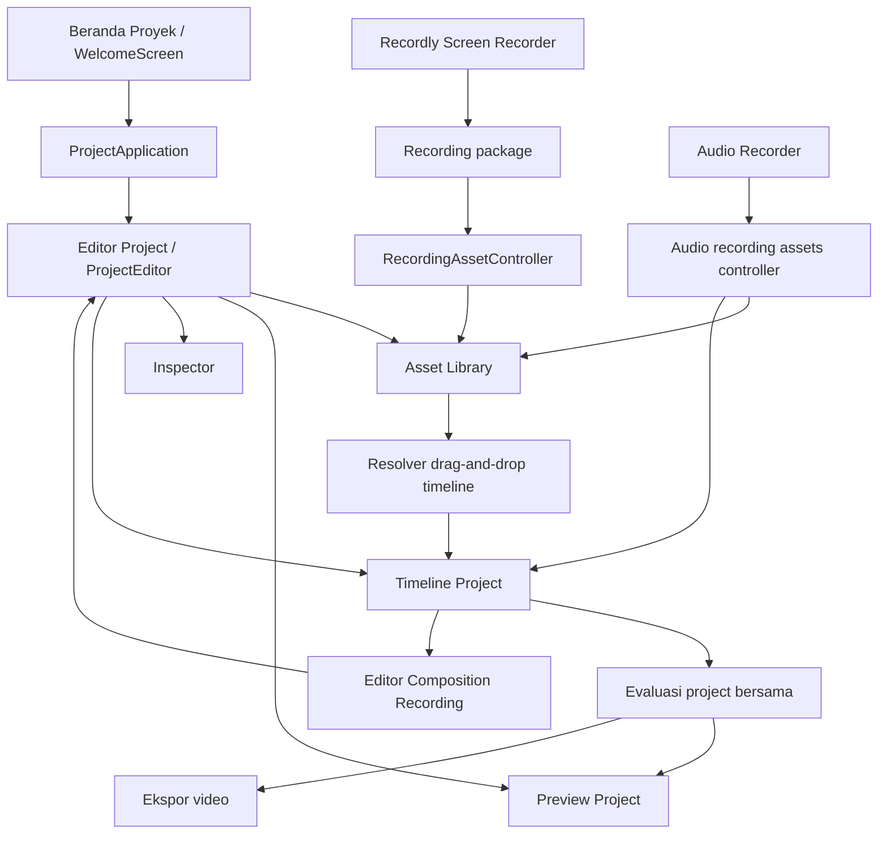

# Katalog Komponen Captr Studio

**Pembaruan:** 5 Oktober 2026 
**Tujuan:** Menamai komponen utama Captr Studio, menjelaskan tanggung jawabnya, dan menunjukkan kode yang menggerakkan tiap fitur.

> Katalog ini mencakup seluruh permukaan produk dan subsistem fitur aktif. Tombol kecil, ikon, dan elemen UI generik dikelompokkan di bawah komponen pemiliknya agar daftar ini berfungsi sebagai peta aplikasi, bukan daftar setiap elemen React.

## Peta alur aplikasi

## Komponen yang terlihat oleh pengguna

| Nama komponen yang disarankan | Nama di kode | Fungsi dan tanggung jawab | Kode terkait |
|---|---|---|---|
| **Beranda Proyek** | `WelcomeScreen` | Halaman pertama aplikasi. Membuat project, membuka file project .captr, mencari/memilih project terakhir, serta menyegarkan daftar project. | [WelcomeScreen](src/components/welcome/WelcomeScreen.tsx#L19-L138), [HomeProjectsController](src/components/editor/useHomeProjects.ts#L8-L71), [listProjectLibraryEntriesUnqueued](electron/ipc/project/manager.ts#L443-L484) |
| **Pengatur alur aplikasi** | `App`, `ProjectApplication` | Memilih tujuan awal antara Home dan editor; memasang project yang dibuka/dibuat; mengatur navigasi, perubahan yang belum disimpan, dan pemulihan sesi capture yang sah. Bukan pemilik editing timeline. | [App](src/App.tsx#L13-L88), [ProjectApplication](src/components/editor/ProjectApplication.tsx#L20-L330), [resolveApplicationBootstrap](src/components/editor/projectNavigation.ts#L37-L63) |
| **Editor Project** | `ProjectEditor` | Workspace utama untuk import media, Record, preview, editing timeline, inspector, Audio Recorder, simpan/rename, dan ekspor. Menghubungkan UI ke project controller. | [ProjectEditor](src/components/editor/ProjectEditor.tsx#L70-L944), [ProjectController](src/components/editor/useProjectController.ts#L26-L266) |
| **Bilah alat project** | Bagian dari `ProjectEditor` | Aksi tingkat project: New/Open, Undo/Redo, Save/Save As/Rename, Record, Export. Nama di topbar mengikuti nama file project. | [ProjectEditor](src/components/editor/ProjectEditor.tsx#L146-L247), [ProjectNameDialog](src/components/editor/ProjectNameDialog.tsx#L25-L87), [performProjectFileOperation](electron/ipc/project/projectFileService.ts#L87-L233) |
| **Bilah alat komponen** | `ProjectToolRail` | Akses cepat untuk menambahkan shape ke timeline. Shape yang dimodelkan: persegi panjang, elips, garis, panah. | [ProjectToolRail](src/components/editor/ProjectToolRail.tsx#L5-L47), [addShape](src/components/editor/ProjectEditor.tsx#L192-L205), [createAndPlaceShape](src/core/timeline/shapeCommands.ts#L14-L43) |
| **Library Aset** | `AssetLibrary` | Pusat aset project: tampilkan recording dan media impor; Import/drag-drop, cari, urutkan, grid/list, preview sumber, place ke timeline, hapus, mulai screen recording, dan buka Audio Recorder. | [AssetLibrary](src/components/editor/AssetLibrary.tsx#L14-L142), [importMedia](src/components/editor/ProjectEditor.tsx#L280-L318), [addToTimeline](src/components/editor/ProjectEditor.tsx#L331-L360) |
| **Preview Aset** | `AssetSourcePreview` | Memutar/menampilkan satu aset sumber dari library. Preview sumber tidak mengubah placement atau edit timeline. | [AssetSourcePreview](src/components/editor/AssetSourcePreview.tsx#L6-L85), digunakan oleh [ProjectEditor](src/components/editor/ProjectEditor.tsx#L803-L813) |
| **Preview Project** | `ProjectPreview` | Merender project pada posisi playhead, termasuk composition recording dan efek visual timeline. Dipakai Editor Project dan Editor Composition Recording. | [ProjectPreview](src/components/editor/ProjectPreview.tsx#L7-L110), [ProjectFrameRenderer](src/lib/exporter/projectFrameRenderer.ts), [evaluateProject](src/core/timeline/evaluation.ts) |
| **Layar awal preview** | `ProjectWelcome` | Empty state saat project belum punya durasi visual. Memberi aksi untuk import media atau mulai Record. | [ProjectWelcome](src/components/editor/ProjectWelcome.tsx#L3-L32), digunakan oleh [ProjectEditor](src/components/editor/ProjectEditor.tsx#L816-L833) |
| **Inspector** | `ProjectInspector` | Mengubah properti clip terpilih: transformasi, teks/shape, keyframe, animasi masuk/keluar, dan transisi. Menyediakan alur untuk membuka editor recording pada placement. | [ProjectInspector](src/components/editor/ProjectInspector.tsx#L130-L622), [TimelineClip dan model efek](src/core/timeline/types.ts#L11-L94) |
| **Timeline Project** | `ProjectTimeline` | Timeline audio/visual bertingkat. Memilih track/clip, mengatur playhead, drag-drop, trim, move, split, duplicate, delete, rate, snapping, dan transisi. | [ProjectTimeline](src/components/editor/ProjectTimeline.tsx#L41-L813), [timelineInteractions](src/components/editor/timelineInteractions.ts#L16-L430) |
| **Editor Composition Recording** | `RecordingCompositionEditor` | Sub-editor untuk mengubah satu placement hasil Recordly: scene, cursor, webcam, zoom, layout, motion, audio rekaman, anotasi, dan cut. Dibuka di workspace yang sama; editnya mengubah composition placement, bukan project/package terpisah. | [RecordingCompositionEditor](src/recording/editor/RecordingCompositionEditor.tsx#L105-L996), [ProjectEditorPanel](src/components/editor/ProjectEditorPanel.tsx#L3-L14), [updateComposition](src/core/timeline/commands.ts) |
| **Audio Recorder** | `AudioRecorderDialog` | Merekam narasi mikrofon secara mandiri dari screen recording. Hasilnya menjadi audio asset dan clip di playhead; navigasi saat rekaman aktif meminta keputusan. | [AudioRecorderDialog](src/components/editor/AudioRecorderDialog.tsx#L39-L258), [createAudioRecordingAssetsController](src/components/editor/useAudioRecordingAssets.ts#L63-L188), [createProjectAudioRecorderNavigation](src/components/editor/projectAudioRecorderNavigation.ts#L9-L49) |
| **Dialog nama project** | `ProjectNameDialog` | Mengatur nama file saat save pertama, Rename, atau Save As. Rename mempertahankan identitas; Save As membuat identitas salinan baru. | [ProjectNameDialog](src/components/editor/ProjectNameDialog.tsx#L25-L87), [commitName](src/components/editor/ProjectEditor.tsx#L220-L238), [performProjectFileOperation](electron/ipc/project/projectFileService.ts#L87-L233), [renameProjectBundle](electron/ipc/project/projectRenameTransaction.ts#L162-L278) |

## Komponen dan layanan fitur

| Nama fitur | Bagian utama | Fungsi | Kode terkait |
|---|---|---|---|
| **Screen Recorder Recordly** | `useScreenRecorder` + native capture + IPC | Mengambil layar/jendela, webcam, mikrofon/audio sistem, pause/resume, cursor/telemetry dan metadata lintas browser/native. Hasil tetap berupa paket editable dengan media/sidecar, bukan video final yang diratakan. | [useScreenRecorder](src/hooks/useScreenRecorder.ts#L262-L310), [registerRecordingHandlers](electron/ipc/register/recording.ts#L397-L450), [ScreenCaptureRecorder](electron/native/ScreenCaptureKitRecorder.swift#L22-L80) |
| **Finalisasi recording ke Assets** | `completedRecordingFromSession`, `RecordingAssetController` | Memeriksa sumber, stream, dan telemetry; menjaga captureId; mencegah duplikasi dan menolak event dari project lama. Mendaftarkan package + asset tanpa menambahkan clip otomatis ke timeline. | [completedRecordingFromSession](src/recording/completedRecording.ts#L7-L19), [RecordingAssetController](src/components/editor/useRecordingAssets.ts#L16-L55), [createRecordingPackage](src/recording/packageAdapter.ts#L3-L5), [registerRecording](src/core/timeline/commands.ts) |
| **Paket dan komposisi recording** | `RecordingPackage`, `RecordComposition` | Package menyimpan sumber capture dan metadata bersama; composition menyimpan edit per placement. Beberapa placement bisa berbagi package tetapi editnya independen. | [recording/types.ts](src/recording/types.ts), [timeline/types.ts](src/core/timeline/types.ts#L59-L94), [packageAdapter.ts](src/recording/packageAdapter.ts), [RecordingCompositionEditor](src/recording/editor/RecordingCompositionEditor.tsx#L105-L996) |
| **Audio Recorder / narasi** | `AudioRecorderDialog` + asset controller | Mengambil mikrofon tanpa memulai screen capture, memvalidasi audio, menyimpan ke project, lalu meletakkan clip pada playhead yang dipilih. | [AudioRecorderDialog](src/components/editor/AudioRecorderDialog.tsx#L39-L258), [useAudioRecordingAssets](src/components/editor/useAudioRecordingAssets.ts#L63-L188), [recording/audioRecorder.ts](src/recording/audioRecorder.ts) |
| **Import dan klasifikasi media** | `AssetLibrary`, `ProjectEditor.importMedia` | Menerima video, gambar, dan audio; memeriksa media sebelum mendaftarkan sumber. Library dapat dipakai tanpa clip terpilih; import tidak otomatis menambahkan placement timeline. | [AssetLibrary](src/components/editor/AssetLibrary.tsx#L25-L142), [importMedia](src/components/editor/ProjectEditor.tsx#L280-L318), [MediaAsset](src/core/timeline/types.ts#L59-L71) |
| **Drop ke track yang benar** | Resolver timeline drop | Mengarahkan asset audio ke track audio dan asset visual ke track visual. Track baru dibuat hanya bila placement bertabrakan dengan clip lain pada rentang waktu yang sama. | [dropKind](src/components/editor/timelineInteractions.ts#L212-L224), [resolveTimelineDropTarget](src/components/editor/timelineInteractions.ts#L226-L272), [applyTimelineDrop](src/components/editor/timelineInteractions.ts#L274-L286), [ProjectTimeline](src/components/editor/ProjectTimeline.tsx#L57-L813) |
| **Shape dasar** | Shape asset + visual clip | Rectangle, ellipse, line, dan arrow disimpan sebagai asset shape tanpa file media; styling dapat ditimpa pada placement. | [ShapeDefinition dan ShapeStyle](src/core/timeline/types.ts#L39-L58), [createAndPlaceShape](src/core/timeline/shapeCommands.ts#L14-L43), [shapePlacementCommand](src/components/editor/ProjectTimeline.tsx#L815-L828) |
| **Overlay teks** | `TextOverlay` + visual clip | Menyimpan teks/styling sebagai komponen visual yang ditempatkan di timeline. Inspector mengubah konten dan propertinya. | [TextOverlay](src/core/timeline/types.ts#L11-L18), [MediaAsset/TimelineClip](src/core/timeline/types.ts#L59-L94), [ProjectInspector](src/components/editor/ProjectInspector.tsx#L130-L622) |
| **Transisi antar-clip** | `ClipTransition` | Menghubungkan dua clip visual bersebelahan pada track yang sama. Preset: cross-dissolve, fade-through, wipe, push. Durasi dibatasi oleh source handle. | [ClipTransitionPreset dan ClipTransition](src/core/timeline/types.ts#L19-L32), [penempatan/eligibility transisi](src/components/editor/ProjectTimeline.tsx#L830-L884), [ProjectInspector](src/components/editor/ProjectInspector.tsx#L130-L622), [evaluation.ts](src/core/timeline/evaluation.ts) |
| **Animasi masuk/keluar komponen** | `ComponentAnimation` | Menambahkan animasi enter/exit pada clip teks, shape, atau komponen visual yang mendukungnya; durasi dibatasi oleh panjang clip. | [ComponentAnimation](src/core/timeline/types.ts#L33-L38), [setter animasi ProjectInspector](src/components/editor/ProjectInspector.tsx#L130-L220), [evaluation.ts](src/core/timeline/evaluation.ts) |
| **Playback dan audio mix timeline** | Evaluator + frame renderer + audio planner | Mengubah waktu project menjadi clip/frame sumber, transisi, animasi, dan kontribusi audio. Evaluasi yang sama dipakai preview serta export. | [evaluateProject](src/core/timeline/evaluation.ts), [audioPlan.ts](src/core/timeline/audioPlan.ts), [ProjectPreview](src/components/editor/ProjectPreview.tsx#L7-L110), [projectFrameRenderer.ts](src/lib/exporter/projectFrameRenderer.ts) |
| **Ekspor video** | `TimelineProjectExporter` | Merender timeline, mengatur encode, melaporkan progres, mendukung cancel, serta membersihkan output sementara jika gagal/dibatalkan. | [TimelineProjectExporter](src/lib/exporter/timelineProjectExporter.ts), [exportProject](src/components/editor/ProjectEditor.tsx#L146-L166), [projectFrameRenderer.ts](src/lib/exporter/projectFrameRenderer.ts) |

## Domain data dan pengelolaan project

| Nama konsep | Arti | Kode utama |
|---|---|---|
| **Timeline Project V3** | Dokumen project otoritatif: identitas/title, canvas, library asset, packages, compositions, tracks, dan relasi transisi. | [TimelineProject](src/core/timeline/types.ts#L104-L116), [createTimelineProject](src/core/timeline/commands.ts#L18-L51), [validateTimelineProject](src/core/timeline/validation.ts) |
| **Media Asset** | Sumber library dengan jenis video, image, audio, recording, text, atau shape. | [MediaAsset](src/core/timeline/types.ts#L59-L71), [registerMedia](src/core/timeline/commands.ts) |
| **Timeline Clip** | Placement asset pada waktu project; menyimpan trim, playback rate, transform, gain, keyframe, animasi, dan composition ID opsional. | [TimelineClip](src/core/timeline/types.ts#L79-L94), [perintah timeline](src/core/timeline/commands.ts) |
| **Timeline Track** | Lane visual/audio dengan lock/mute/hidden dan kumpulan clip. Urutan visual di UI menyatakan stacking overlay; track domain tetap sumber data. | [TimelineTrack](src/core/timeline/types.ts#L95-L103), [timelineTracksInDisplayOrder](src/components/editor/timelineInteractions.ts#L191-L195), [ProjectTimeline](src/components/editor/ProjectTimeline.tsx#L57-L813) |
| **History project** | Undo/redo berbasis command/snapshot; aksi timeline memakai jalur command yang sama. | [ProjectController](src/components/editor/useProjectController.ts#L26-L266), [history.ts](src/core/timeline/history.ts), [timelineActionCommand](src/components/editor/timelineInteractions.ts#L379-L430) |
| **Simpan .captr V3** | Membundel semua aset library dan media package. Project tanpa clip timeline tetap valid; thumbnail preview disimpan di bundle. | [saveAndBundleProject](electron/ipc/register/project/save.ts#L22-L48), [stageTimelineProject](electron/ipc/project/timelineBundle.ts), [loadProjectFromPathUnqueued](electron/ipc/project/manager.ts#L499-L681), [inspectProjectBundle](electron/ipc/project/projectBundle.ts#L286-L412) |
| **Rename dan Save As** | Operasi file project terverifikasi. Rename mempertahankan projectId; Save As membuat identitas baru dan mempertahankan file asal. | [performProjectFileOperation](electron/ipc/project/projectFileService.ts#L87-L233), [renameProjectBundle](electron/ipc/project/projectRenameTransaction.ts#L162-L278), [ProjectController](src/components/editor/useProjectController.ts#L26-L266) |
| **Jembatan renderer–Electron** | Menyediakan dialog file, akses media lokal, IPC capture, inspeksi recording, dan operasi project untuk desktop. | [electron/ipc/register/project](electron/ipc/register/project), [electron/ipc/register/recording.ts](electron/ipc/register/recording.ts), [electron/preload.ts](electron/preload.ts) |
| **Teks UI dan lokalisasi** | Menyediakan label antarmuka editor dari resource pesan/lokalisasi. | [useProjectMessages](src/components/editor/useProjectMessages.ts) |

## Hubungan dua editor

| Editor | Tujuan | Batas tanggung jawab |
|---|---|---|
| **Editor Project** (`ProjectEditor`) | Menyusun media dan komponen di track visual/audio, mengatur project, preview, save, dan export. | Memiliki project aktif, library, timeline, selection, history, dan lifecycle file project. |
| **Editor Composition Recording** (`RecordingCompositionEditor`) | Mengubah tampilan/efek satu placement yang bersumber dari Recordly. | Mengubah `RecordComposition` pada clip terpilih; tidak memiliki New/Open/Save/Export dan tidak mengubah package sumber. |

## Dukungan media yang tercermin di model saat ini

- Jenis media domain yang eksplisit: **video, image, audio, recording, text, shape**.
- Shape dasar: **rectangle, ellipse, line, arrow**.
- Transisi antar-clip: **cross-dissolve, fade-through, wipe, push**.
- Animasi komponen mempunyai model **enter/exit**.
- **GIF belum memiliki jenis asset domain tersendiri** di MediaAsset. Jika GIF animasi akan didukung sebagai fitur, tentukan jalur decode/render sebelum mencantumkannya sebagai dukungan aktif.

## Cara menggunakan katalog ini

Saat mengubah fitur, mulai dari komponen UI pada tabel lalu telusuri layanan/domain yang ditautkan. Pertahankan batas pemilik data: aset sumber dimiliki project, edit recording dimiliki composition per placement, dan preview/export menggunakan evaluasi timeline yang sama. Nama Indonesia di tabel adalah nama produk yang disarankan; identifier kode dipertahankan sesuai implementasi saat ini.
