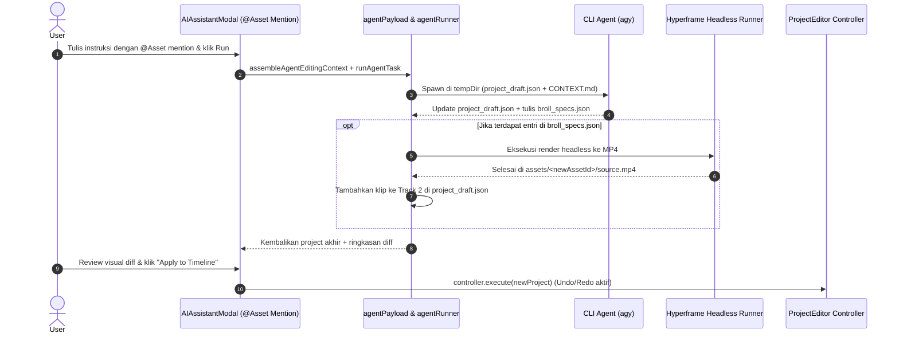

# Arsitektur Hyperframe SDK, Multi-Track Video Editor, & Asset Mention

Dokumen ini merangkum hasil desain dan kesepakatan arsitektur untuk integrasi pembuatan video mandiri (A-Roll & B-Roll), stabilisasi track video editor, dan fitur context mention aset pada Captr Studio.

---

## 1. Ringkasan Kebutuhan & Ruang Lingkup (Understanding Summary)

* **Hyperframe SDK (Asset Pre-Renderer)**: Headless rendering engine lokal untuk menghasilkan klip B-Roll grafis (tipografi kinetik, kartu mockup UI, data visual, callout) langsung ke format MP4 di dalam folder `assets/<assetId>/`.
* **Arsitektur Multi-Track (A-Roll vs B-Roll)**: Penataan sistem track timeline Captr Studio dengan layer visual yang jelas (Track 1 untuk A-Roll pembicara utama, Track 2 untuk overlay B-Roll visual).
* **Asset Context Mention (`@Asset`)**: Autocomplete tag di modal AI Assistant untuk memilih dan menetapkan peran aset spesifik secara langsung melalui prompt.
* **Non-Destruktif & Undoable**: Semua modifikasi timeline oleh agent divalidasi dengan schema `TimelineProject` dan dapat di-undo via `Ctrl+Z`.

---

## 2. Asumsi Teknis (Technical Assumptions)

1. **Local Headless Execution**: Hyperframe dijalankan di latar belakang via background subprocess (misal `cargo-fframes` / Node runner) dengan batas timeout 45 detik tanpa memblokir UI editor.
2. **Kesesuaian Resolusi & Dimensi**: Output video B-Roll yang dirender otomatis mewarisi setting dimensi (`width`, `height`) dan framerate project aktif.
3. **Penyimpanan Berstandar V3**: Seluruh media B-Roll terdaftar resmi di `project.json` dan tersimpan aman di bundle `.captr` saat user menekan `Ctrl+S`.

---

## 3. Decision Log (Catatan Keputusan)

| # | Keputusan | Alternatif Dipertimbangkan | Alasan Pemilihan |
|---|---|---|---|
| 1 | **Two-Stage Pipeline** | MCP Tool Calling, Preset Statis | Menjaga isolasi proses render, mencegah subprocess macet, fleksibilitas kreatif tinggi. |
| 2 | **Asset Pre-Renderer (MP4)** | Dynamic Component Canvas | Kompatibel 100% dengan pipeline WebCodecs/WebGL Captr Studio tanpa overhead komputasi di canvas. |
| 3 | **Pemisahan `broll_specs.json`** | Menggabungkan langsung ke `project_draft.json` | Memastikan schema timeline tetap valid dan tidak tercemar format spesifikasi template eksternal. |
| 4 | **Autocomplete `@Asset` Mention** | Dropdown terpisah di luar textarea | Alur penulisan prompt lebih alami (mirip Discord/Slack/GitHub). |
| 5 | **Graceful Fallback** | Gagalkan seluruh proses jika 1 B-roll error | Editan A-Roll tetap aman; user tidak kehilangan hasil trimming vokal. |

---

## 4. Desain Sistem & Spesifikasi Detail

### 4.1. Struktur Lapisan Track (Track Stacking Order)

```text
Track 3 (Overlay / Text) : Subtitle Overlay, Karaoke Highlights, Lower-Thirds
Track 2 (B-Roll Visual)  : Klip video Hyperframe MP4, Mockup Gambar, Animasi Grafis
Track 1 (A-Roll Base)    : Video rekaman pembicara utama (kamera / screen) + Audio utama
```

- **Audio Mixing**: Klip di Track 2 (B-Roll grafis) default bisu (`volume: 0` atau tanpa audio track), mempertahankan kesinambungan vokal dari Track 1 (A-Roll).
- **Visual Priority**: Canvas me-render track dari indeks terkecil (bawah) ke terbesar (atas), sehingga Track 2 otomatis menimpa Track 1.

### 4.2. Data Flow: Two-Stage Agent Pipeline



### 4.3. Format Spesifikasi `broll_specs.json`

```json
[
  {
    "id": "broll-anim-1",
    "timelineStartUs": 12500000,
    "durationUs": 4000000,
    "type": "kinetic_typography",
    "title": "Arsitektur Modular",
    "subtitle": "Koneksi Langsung ke Agent",
    "theme": "dark_modern",
    "layout": "fullscreen_overlay"
  }
]
```

### 4.4. Autocomplete Mention `@Asset` di Antarmuka Editor

- Mengetik `@` di `AIAssistantModal` memicu popover autocomplete berisi daftar semua aset aktif (Kamera, Layar, Audio, Gambar).
- Saat tag dipilih, sistem menyisipkan tag terstruktur seperti `@Screen-1` atau `@Cam-Main`.
- Di `CONTEXT.md`, daftar aset dihubungkan dengan tag mention sehingga agent CLI memahami peran yang diminta pengguna.

---

## 5. Rencana Fase Implementasi (Roadmap: Opsi 3 -> 1 -> 2)

* **Fase 1: Hyperframe Engine Runner & B-Roll Specification Pipeline (Opsi 3)**
  1. Buat tipe TypeScript untuk `broll_specs.json` (`src/core/timeline/brollTypes.ts`).
  2. Implementasikan headless runner IPC di Electron (`electron/ipc/hyperframe/hyperframeRunner.ts`) untuk memanggil render MP4 ke folder aset.
  3. Integrasikan stage rendering Hyperframe ke dalam `agentRunner.ts` setelah agent selesai menulis spec.

* **Fase 2: Stabilisasi Multi-Track Editor & A-Roll/B-Roll Visual Layouting (Opsi 1)**
  1. Standarisasi urutan komposisi track di `FrameRenderer.ts` / `ProjectPreview.tsx` agar Track 2 konsisten menimpa Track 1.
  2. Tambahkan dukungan pembuatan track otomatis saat B-Roll diinjeksikan.
  3. Handle audio mixing agar klip B-Roll grafis tidak memotong audio A-Roll yang sedang berjalan.

* **Fase 3: UI Asset Context Mention (`@Asset`) di AI Assistant (Opsi 2)**
  1. Buat komponen mention popover pada textarea `AIAssistantModal.tsx`.
  2. Hubungkan mention tag ke pemetaan aset di `agentPayload.ts` (`CONTEXT.md`).
  3. Tambahkan preset prompt baru: *"Gunakan @Asset-A sebagai A-Roll dan tambahkan Hyperframe B-Roll di bagian penting"*.
